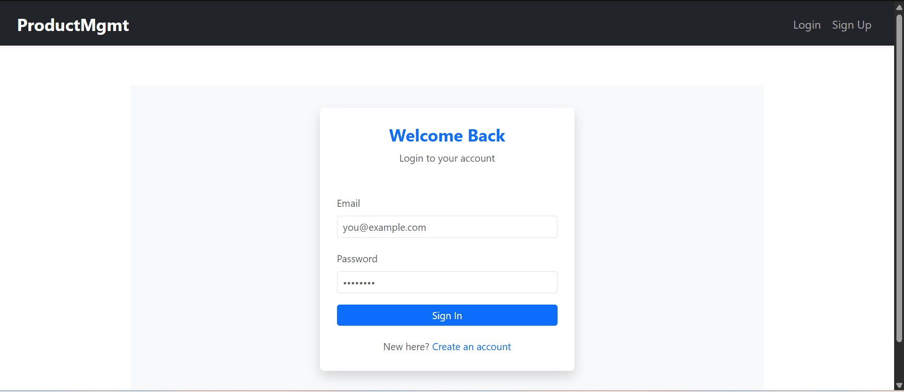

# 🌟 Product Management Web App

Welcome to the **Product Management Web App** — a feature-rich, modern full-stack application designed for managing products with role-based access. Built with **Spring Boot**, **React.js**, **JWT Authentication**, and PostgreSQL.

---

## 🚀 Live Demo

🔗 **Frontend (Netlify)**: [https://projectmang.netlify.app](https://projectmang.netlify.app)  
🔗 **Backend (Render)**: [https://backend-server-1dgg.onrender.com](https://backend-server-1dgg.onrender.com)

---

## 🧠 Tech Stack

### 🔹 Frontend
- **React.js** with Hooks
- **React Router DOM** for routing
- **Bootstrap** for styling

### 🔹 Backend
- **Spring Boot 3.4.4**
- **Java 21**
- **Spring Security + JWT** for Authentication & Authorization
- **PostgreSQL** Database
- **JPA (Hibernate)** for ORM

---

## 🔐 Features

✅ User Signup & Login  
✅ JWT-Based Secure Authentication  
✅ Role-Based Access (Admin/User)  
✅ Product CRUD Operations (Admin Only)  
✅ Product Filtering, Searching & Sorting (Dashboard)  
✅ Image Upload for Products  
✅ Responsive UI with Bootstrap  

---

## 📸 Screenshots


### 🔐 Login Page


### 📝 Signup Page


### 📦 Product Dashboard


### ➕ Add/Edit Product (Admin only)


---

## 🧰 Project Setup

### 🖥️ Backend (Spring Boot)

#### 1. Clone the Repository:
```bash
git clone https://github.com/your-repo/productManagementApp.git
cd productManagementApp
```

#### 2. Configure PostgreSQL
Update your `application.properties`:
```properties
spring.datasource.url=jdbc:postgresql://localhost:5432/your_db
spring.datasource.username=your_username
spring.datasource.password=your_password
```

#### 3. Run the App
```bash
./mvnw spring-boot:run
```

---

### 🌐 Frontend (React.js)

#### 1. Navigate to React Project:
```bash
cd zynetic_assignment_frontend
```

#### 2. Install Dependencies
```bash
npm install
```

#### 3. Build Project
```bash
npm run build
```

#### 4. Deploy to Netlify
```bash
netlify deploy --prod --dir=dist
```
> If using Vite, your build folder is `dist` not `build`

---

## 🌍 Deployment Notes

### 🔁 Keep Render Backend Awake (Optional for free tier)
To prevent your backend from sleeping on Render:
```js
useEffect(() => {
  const ping = () => {
    fetch('https://backend-server-1dgg.onrender.com/api/auth/ping')
      .then(() => console.log("Backend pinged"));
  };
  const interval = setInterval(ping, 270000); // every 4.5 minutes
  ping();
  return () => clearInterval(interval);
}, []);
```
> Added this Code to Keep the server alive (As i m working on free tier subscrpition)

---

## 🧑‍💻 Author

Made with ❤️ by Raja 
Connect on [LinkedIn]([https://linkedin.com/in/your-profile](http://linkedin.com/in/raja-kumar-rana-a60715252))

---


